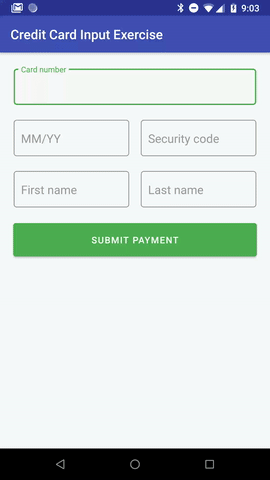

# Android Credit Card Input Exercise
 

### Introduction
This "Credit Card Input Exercise" was a from-scratch "take-home project" assigned to me by a company
I was interviewing with for an Android Developer role. They liked my submission well enough to bring me in for
onsites, so I thought I'd put it up on GitHub as another code sample, considering that absolutely
nothing about it is specific to that company (and for this repo I redid the README so it no longer contains
the quoted requirements/instructions from their specs document).

I'll probably update this project a little more once a stable release version of
com.google.android.material:material:1.1.0 comes out -- among other things it will add some additional features
to the TextInputLayout/TextInputEditText views.

### Requirements

Basically, they asked me to create an Android "screen" that would allow a user to enter and submit the
following data from an American Express, Discover, MasterCard, or Visa credit card: 
* Credit card number
* Expiration date (MM/YY format)
* CVV security code
* First name
* Last name

If any of the entered data was invalid, the user needed to be notified so they could correct it.
In addition to not having issues like empty fields or a badly-formed or expired expiration date,
credit card data also had to meet these criteria to be considered valid:
* Credit card numbers needed to be in valid American Express, Discover, MasterCard, or Visa format according
to the specs listed on https://www.cybersource.com/developers/getting_started/test_and_manage/best_practices/card_type_id/
* Credit card numbers also needed to pass Luhn validation - see https://en.wikipedia.org/wiki/Luhn_algorithm
* The CVV had to meet these criteria: https://www.cvvnumber.com/cvv.html
* First and last names could only contain characters that were "alphabetical and spaces". 
* When the user-submitted valid credit card data, the app should pop up an alert dialogue notifying them that the payment was successful.
